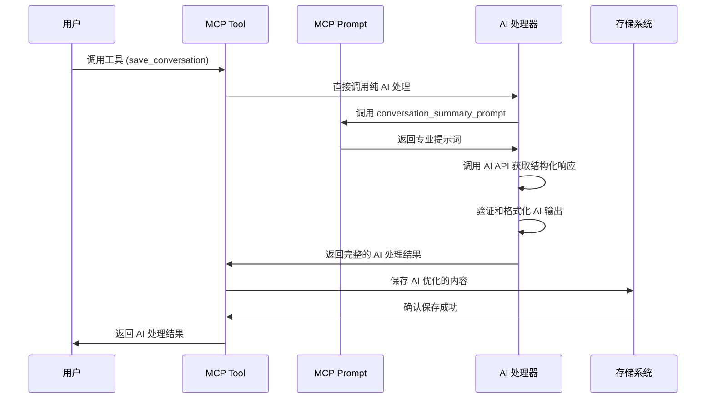

# 🚀 Synapse MCP AI 增强实施规划

## 📋 项目概述

**目标**: 使用 AI 提示词系统完全重构对话保存和解决方案提取，从"基本不可用"提升到"高度实用"。

**核心理念**: 彻底替换现有基于规则的处理方式，全面采用 AI 驱动的智能分析，通过专业提示词产生真正有价值的知识库内容。

## 🎯 改进目标

### 需要完全替换的部分
- ❌ **删除** `ContentProcessor` 的简单清理逻辑 → AI 智能内容分析
- ❌ **删除** `SummaryGenerator` 的启发式摘要 → AI 专业总结生成
- ❌ **删除** `TagExtractor` 的关键词匹配 → AI 智能标签识别
- ❌ **删除** `ImportanceEvaluator` 的规则评分 → AI 价值评估
- ❌ **删除** 整个 `extract_solutions.py` 的规则匹配系统 → AI 智能解决方案提取
- ❌ **删除** 所有启发式算法和硬编码规则

### 新的 AI 驱动架构
- ✅ **纯 AI 处理**: 所有内容分析完全由 AI 完成
- ✅ **专业提示词**: 使用 `@mcp.prompt` 定义领域专业的提示模板
- ✅ **结构化输出**: AI 直接生成标准化的 JSON 结构
- ✅ **质量保证**: AI 自评估和质量控制

## 🏗️ 技术架构设计

### 1. MCP Prompt 系统集成

使用 `@mcp.prompt()` 装饰器定义专门的 AI 提示词模板：

```python
from mcp.server.fastmcp import FastMCP

mcp = FastMCP("synapse-mcp", lifespan=app_lifespan)

@mcp.prompt()
def conversation_summary_prompt(title: str, content: str, context: str = "general") -> str:
    """生成对话总结的专业提示词模板"""
    return f"""
请对以下技术对话进行专业总结和结构化整理：

**对话标题**: {title}
**应用场景**: {context}

**原始内容**:
{content}

请按以下结构输出：
1. **核心问题**: 用一句话概括主要问题
2. **解决思路**: 简洁描述解决方法和关键步骤  
3. **关键代码**: 提取最重要的代码片段（如果有）
4. **要点提炼**: 3-5个要点，突出可重用的经验
5. **适用场景**: 这个解决方案适用的具体场景

要求：
- 保持技术准确性，不要添加原文没有的信息
- 突出实用性和可重用性
- 用清晰的结构化格式输出
- 如果是代码相关，保留完整的代码块
"""

@mcp.prompt()
def solution_extraction_prompt(content: str, extract_type: str = "all") -> str:
    """生成解决方案提取的专业提示词模板"""
    type_instructions = {
        "code": "重点提取可执行的代码片段、函数、类定义等",
        "approach": "重点提取方法论、解决策略、步骤流程等", 
        "pattern": "重点提取设计模式、最佳实践、架构模式等",
        "all": "全面提取代码、方法和模式三种类型的解决方案"
    }
    
    return f"""
请从以下技术内容中智能提取可重用的解决方案：

**提取类型**: {extract_type}
**具体要求**: {type_instructions.get(extract_type, type_instructions["all"])}

**内容**:
{content}

请为每个解决方案按以下格式输出：

## 解决方案 [序号]
**类型**: [code/approach/pattern]
**标题**: [简洁的解决方案标题]
**描述**: [解决什么问题，适用什么场景]
**内容**:
```[语言]
[具体的代码或详细步骤]
```
**可重用性**: [评估 1-5 分，说明理由]
**适用场景**: [具体的使用场景]

要求：
- 只提取真正有价值和可重用的解决方案
- 确保代码的完整性和可执行性  
- 为每个解决方案提供清晰的使用说明
- 过滤掉过于简单或特定的内容
- 按重要性和实用性排序
"""

@mcp.prompt()
def content_optimization_prompt(title: str, summary: str, solutions: str) -> str:
    """生成内容优化的专业提示词模板"""
    return f"""
请优化整理以下技术知识内容，使其更加结构化和易于理解：

**标题**: {title}
**总结**: {summary}
**解决方案**: {solutions}

请按以下格式重新组织内容：

# {title}

## 📝 问题概述
[简洁描述核心问题和背景]

## 💡 解决方案
### 核心思路
[主要解决思路和原理]

### 实现步骤  
[如果是方法论，列出具体步骤]

### 代码实现
[如果有代码，提供完整可用的代码]

## 🎯 关键要点
- [要点1]
- [要点2] 
- [要点3]

## 🔍 适用场景
[具体的使用场景和限制条件]

## 🏷️ 标签建议
[建议3-5个相关技术标签]

要求：
- 保持原有信息的准确性
- 使用清晰的 Markdown 格式
- 突出实用性和可操作性
- 确保内容的逻辑连贯性
"""
```

### 2. 全新的纯 AI 架构

```
旧流程: 用户内容 → 规则处理 → 启发式算法 → 低质量存储
新流程: 用户内容 → AI 提示词 → 智能分析 → 高质量存储

完全 AI 处理流程:
├── AI 内容理解和清理
├── AI 专业总结生成
├── AI 智能标签识别  
├── AI 解决方案提取
├── AI 质量评估
└── AI 结构化输出
```

## 📝 实施计划

### Phase 1: 基础设施搭建 (第1天)

#### 1.1 创建纯 AI 处理系统 🕐 2小时
```bash
# 创建全新 AI 模块，完全替换旧逻辑
src/synapse/ai/
├── __init__.py
├── prompts.py           # MCP prompt 定义
├── ai_processor.py      # AI 调用处理器
└── ai_content_manager.py # 纯 AI 内容管理器
```

**任务清单:**
- [ ] 定义 3 个核心 `@mcp.prompt()` 模板
- [ ] 创建 AI 调用处理器，完全替换规则处理
- [ ] 设计纯 AI 内容处理管道

#### 1.2 完全重写 MCP 工具 🕐 3小时

**save-conversation 全面重构:**
```python
@mcp.tool()
async def save_conversation(title: str, content: str, ..., ctx: Context = None) -> dict:
    """纯 AI 驱动的对话保存工具"""
    
    # 1. 直接调用 AI 处理，不再使用任何规则处理
    ai_result = await ai_processor.process_conversation_completely(
        title=title,
        content=content,
        ctx=ctx
    )
    
    # 2. AI 返回完整的结构化数据
    structured_conversation = ConversationRecord(
        title=ai_result.title,
        content=ai_result.optimized_content,     # AI 优化的内容
        summary=ai_result.professional_summary,  # AI 专业总结
        tags=ai_result.intelligent_tags,         # AI 识别的标签
        category=ai_result.category,             # AI 分类
        importance=ai_result.importance_score,   # AI 评分
        ai_metadata=ai_result.metadata          # AI 生成的元数据
    )
    
    # 3. 直接保存 AI 处理结果
    return save_ai_processed_conversation(structured_conversation)
```

**任务清单:**
- [ ] **完全删除** `ContentProcessor`, `SummaryGenerator`, `TagExtractor`, `ImportanceEvaluator`
- [ ] 重写 `save_conversation` 工具，纯 AI 处理
- [ ] 更新数据模型支持 AI 结构化输出

#### 1.3 重构数据模型 🕐 1小时

**全面重构 ConversationRecord:**
```python
@dataclass
class ConversationRecord:
    # 基础字段
    id: str
    title: str
    content: str                        # AI 优化后的结构化内容
    
    # 完全由 AI 生成的字段
    ai_summary: str                     # AI 专业总结
    ai_tags: List[str]                  # AI 识别的智能标签  
    ai_category: str                    # AI 智能分类
    ai_importance: int                  # AI 重要性评分 (1-5)
    ai_quality_score: float            # AI 内容质量评分 (0-1)
    ai_extraction_metadata: Dict       # AI 提取的元数据
    
    # 删除所有基于规则的字段
    # 不再有: category, importance, tags (旧版本)
    created_at: datetime
    updated_at: datetime
```

**任务清单:**
- [ ] **删除** 所有基于规则的字段和逻辑
- [ ] 重构数据模型为纯 AI 驱动结构
- [ ] 更新序列化逻辑支持新的 AI 字段

### Phase 2: 核心功能实现 (第2天)

#### 2.1 实现纯 AI 处理器 🕐 4小时

```python
class AIContentProcessor:
    """纯 AI 内容处理器，完全替换所有规则处理"""
    
    async def process_conversation_completely(self, title: str, content: str, ctx: Context = None) -> AIProcessedResult:
        """完全由 AI 处理对话内容，不使用任何规则"""
        
    async def extract_solutions_completely(self, content: str, extract_type: str, ctx: Context = None) -> List[AISolution]:
        """完全由 AI 提取解决方案，删除所有规则匹配"""
        
    async def invoke_ai_prompt(self, prompt_name: str, **kwargs) -> Dict:
        """调用 MCP prompt 并解析 AI 结构化响应"""
        
    async def validate_ai_output(self, ai_result: Dict, expected_schema: Dict) -> bool:
        """验证 AI 输出是否符合预期结构"""
```

**任务清单:**
- [ ] **删除** 所有规则处理代码 (ContentProcessor等)
- [ ] 实现纯 AI 驱动的内容处理管道  
- [ ] 建立 MCP prompt 调用和响应解析机制
- [ ] 添加 AI 输出结构验证

#### 2.2 完全重写 extract-solutions 工具 🕐 3小时

**纯 AI 驱动的解决方案提取:**
```python
@mcp.tool()
async def extract_solutions(conversation_id: str, extract_type: str = "all", ctx: Context = None) -> dict:
    """完全由 AI 驱动的解决方案提取工具"""
    
    # 加载对话
    conversation = self.file_manager.load_conversation(conversation_id)
    
    # 直接使用 AI 进行完整分析，不再有任何规则处理
    ai_solutions = await ai_processor.extract_solutions_completely(
        content=conversation.content,
        extract_type=extract_type,
        conversation_context=conversation.ai_summary,  # 利用已有的 AI 分析
        ctx=ctx
    )
    
    # AI 自评估质量和过滤
    validated_solutions = await ai_processor.validate_and_score_solutions(ai_solutions)
    
    return format_ai_solutions_result(validated_solutions, conversation_id)
```

**删除的文件和类:**
- [ ] **完全删除** `extract_solutions.py` (1266行代码)
- [ ] **删除** `CodeBlockExtractor`, `SolutionClassifier`, `ReusabilityEvaluator`
- [ ] **删除** `SolutionDeduplicator`, `QualityAssessor`, `ExtractSolutionsTool`
- [ ] **删除** 所有启发式算法和硬编码规则

**任务清单:**
- [ ] 重写 extract_solutions 工具为纯 AI 处理
- [ ] 建立 AI 解决方案提取和验证机制  
- [ ] 更新 Solution 数据模型为 AI 驱动结构

### Phase 3: 优化和集成 (第3天)

#### 3.1 AI 系统优化 🕐 2小时
- [ ] AI 调用缓存机制（避免重复处理相同内容）
- [ ] 批量处理优化（多个对话并行 AI 处理）
- [ ] AI 响应时间监控和优化
- [ ] 结构化输出解析优化

#### 3.2 纯 AI 质量保证 🕐 2小时  
- [ ] AI 输出结构化验证
- [ ] AI 自评估结果校验
- [ ] 多次 AI 调用结果一致性检查
- [ ] AI 处理失败时的错误机制

#### 3.3 纯 AI 系统测试 🕐 2小时
- [ ] 端到端 AI 处理流程测试
- [ ] AI vs 规则系统效果对比验证
- [ ] AI 输出质量基准测试  
- [ ] AI 处理各种边界情况测试

#### 3.4 文档和配置 🕐 2小时
- [ ] 更新 API 文档
- [ ] 添加配置说明
- [ ] 编写使用指南
- [ ] 性能调优建议

## ⚙️ 技术实现细节

### 纯 AI 处理流程设计


### 纯 AI 处理策略
```python
async def ai_only_operation(content, operation_type, ctx=None):
    """纯 AI 处理操作，不使用任何规则"""
    try:
        # 直接 AI 处理，不再检查条件
        ai_result = await process_with_ai_completely(content, operation_type, ctx)
        
        # AI 自验证结果质量
        if ai_result.quality_score < 0.7:
            # 重新用不同提示词处理
            ai_result = await reprocess_with_enhanced_prompt(content, operation_type, ctx)
        
        return ai_result
        
    except Exception as e:
        # AI 处理失败则直接报错，不再降级
        raise AIProcessingError(f"AI 处理失败: {str(e)}")
```

### AI 配置管理
```python
@dataclass
class AIOnlyConfig:
    ai_timeout_seconds: int = 30
    ai_max_retries: int = 3
    ai_quality_threshold: float = 0.8    # AI 输出质量阈值
    ai_cache_enabled: bool = True
    ai_parallel_processing: bool = True  # 并行处理多个内容
    ai_reprocessing_enabled: bool = True # 质量不达标时重新处理
    # 删除了所有降级和规则相关的配置
```

## 📊 成功指标

### 定量指标
- **内容质量革命性提升**: 纯 AI 处理 vs 旧规则系统的可用性对比 (目标: 从不可用到高度可用)
- **AI 提取准确率**: 解决方案提取的准确性和完整性 (目标 > 90%)
- **AI 响应时间**: 纯 AI 处理的性能表现 (目标 < 10s)
- **AI 处理成功率**: AI 处理的稳定性 (目标 > 98%)

### 定性指标
- **内容专业化程度**: AI 生成内容的专业性和结构化程度
- **解决方案实用性**: AI 提取内容的实际应用价值和可重用性
- **知识库质量**: 整体知识库的搜索和检索体验提升
- **用户满意度**: 从"基本不可用"到"高度实用"的体验改善

## 🚨 风险控制

### 技术风险
- **AI API 依赖**: 建立稳定的 AI 调用机制和缓存系统
- **处理性能**: AI 调用的时间成本控制和并行优化  
- **输出质量**: AI 结果验证和重新处理机制

### 系统风险  
- **API 接口**: 保持 MCP 工具接口的向后兼容
- **数据迁移**: 旧数据向新 AI 驱动结构的平滑迁移
- **功能一致性**: 确保 AI 处理结果的一致性和可预测性

## 📚 后续扩展规划

### Phase 4: 高级功能 (后续)
- [ ] 多轮对话上下文理解
- [ ] 跨对话的解决方案关联分析
- [ ] 个性化内容推荐
- [ ] 社区知识共享机制

### Phase 5: 智能化升级 (未来)
- [ ] 自适应提示词优化
- [ ] 用户反馈学习机制
- [ ] 领域专业化知识处理
- [ ] 多模态内容支持

---

## 🔥 代码删除清单

### 需要完全删除的文件和代码
- [ ] `src/synapse/tools/save_conversation.py` 中的所有规则处理类：
  - `ContentProcessor` (76行代码)
  - `SummaryGenerator` (114行代码) 
  - `TagExtractor` (107行代码)
  - `ImportanceEvaluator` (80行代码)
  - `DuplicateDetector` (58行代码)
  
- [ ] **完全删除** `src/synapse/tools/extract_solutions.py` (1266行代码)：
  - `CodeBlockExtractor`
  - `SolutionClassifier`
  - `ReusabilityEvaluator`
  - `SolutionDeduplicator`
  - `QualityAssessor`
  - `ExtractSolutionsTool`

### 重构的核心逻辑
```python
# 旧代码 (删除)
cleaned_content = ContentProcessor.clean_content(content)
summary = SummaryGenerator.generate_summary(title, cleaned_content, code_blocks)
tags = TagExtractor.extract_tags(title, cleaned_content, code_blocks)

# 新代码 (AI 驱动)
ai_result = await ai_processor.process_conversation_completely(title, content, ctx)
structured_data = ai_result.to_conversation_record()
```

## 🎯 明天开始执行

**核心策略**: 彻底删除规则处理，100% AI 驱动重构
**优先级**: Phase 1.1 → Phase 1.2 → Phase 1.3
**预期产出**: 完全基于 AI 的高质量内容处理系统
**验证方式**: AI 处理结果 vs 旧规则系统的质量对比验证

**删除代码量**: ~1500行规则处理代码 → 替换为 ~300行 AI 调用代码

准备好进行这场 AI 革命了吗？ 🚀